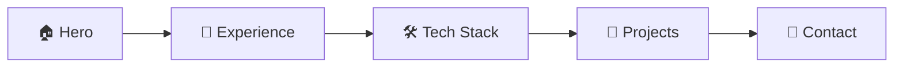

<div align="center">

# 🎨 Portfolio Website

### Современное портфолио fullstack-разработчика

[](https://developer.mozilla.org/en-US/docs/Web/HTML)
[](https://developer.mozilla.org/en-US/docs/Web/CSS)
[](https://developer.mozilla.org/en-US/docs/Web/JavaScript)

[🌐 Посмотреть сайт](https://omasy4s.github.io/Portfolio-website/) • [📝 Документация](#-возможности) • [🚀 Запуск](#-быстрый-старт)

---

</div>

## ✨ Возможности

<table>
<tr>
<td width="50%">

### 🎬 Анимации
- 🌊 **Живой фон** с движущейся сеткой
- ✨ **Плавающие фигуры** с градиентами
- 🎯 **Параллакс эффект** при скролле
- 🌈 **Анимированный градиент** в тексте
- 💫 **Smooth transitions** везде

</td>
<td width="50%">

### 🎮 Интерактивность
- 💡 **Умные тултипы** за курсором
- 🔗 **Плавная прокрутка** к секциям
- 📍 **Активная навигация** в реальном времени
- 🎨 **Hover эффекты** на карточках
- 🖱️ **Реакция на мышь** в hero секции

</td>
</tr>
</table>

### 📱 Адаптивный дизайн

```
✅ Desktop (1920px+)    ✅ Laptop (1024px+)
✅ Tablet (768px+)      ✅ Mobile (320px+)
```

## 🎨 Дизайн

### Цветовая палитра

<table>
<tr>
<td align="center" width="25%">
<br/>
<code>#0a0a0f</code><br/>
<sub>Основной фон</sub>
</td>
<td align="center" width="25%">
<br/>
<code>#13131a</code><br/>
<sub>Вторичный фон</sub>
</td>
<td align="center" width="25%">
<br/>
<code>#6366f1</code><br/>
<sub>Акцент</sub>
</td>
<td align="center" width="25%">
<br/>
<code>#e4e4e7</code><br/>
<sub>Текст</sub>
</td>
</tr>
</table>

## 📦 Структура сайта



| Секция | Описание |
|--------|----------|
| **Hero** | Приветственная секция с анимированным фоном |
| **Experience** | Опыт работы в формате timeline |
| **Tech Stack** | Технологический стек по категориям |
| **Projects** | Избранные проекты с описанием |
| **Contact** | Контактная информация и ссылки |

## 🛠️ Технологический стек

<div align="center">

| Технология | Применение |
|:----------:|:-----------|
|  | Семантическая разметка |
|  | Grid, Flexbox, Animations |
|  | ES6+, DOM API, Observers |
|  | Шрифт Inter |

</div>

## 🚀 Быстрый старт

### Вариант 1: Прямое открытие
```bash
# Просто откройте файл в браузере
open index.html
```

### Вариант 2: Локальный сервер

<details>
<summary><b>Python</b></summary>

```bash
python -m http.server 8000
# Откройте http://localhost:8000
```
</details>

<details>
<summary><b>Node.js</b></summary>

```bash
npx serve
# Откройте предложенный URL
```
</details>

<details>
<summary><b>VS Code</b></summary>

```bash
# Установите расширение Live Server
# Нажмите "Go Live" в статус-баре
```
</details>

## 📁 Структура проекта

```
Portfolio-website/
│
├── 📄 index.html          # Главная страница
├── 🎨 style.css           # Все стили (927 строк)
├── ⚡ script.js           # JavaScript (256 строк)
└── 📖 README.md           # Документация
```

### Организация CSS

```
style.css
├── 🎨 Variables          # CSS переменные
├── 🔄 Reset & Base       # Базовые стили
├── 🧭 Navigation         # Навигация
├── 🌟 Hero Section       # Главная секция
├── ⏱️ Timeline           # Опыт работы
├── 🛠️ Tech Stack         # Технологии
├── 🚀 Projects           # Проекты
├── 📧 Contact            # Контакты
└── 📱 Responsive         # Адаптивность
```

### JavaScript функции

| Функция | Назначение |
|---------|------------|
| `handleSmoothScroll()` | Плавная прокрутка к секциям |
| `updateActiveNav()` | Подсветка активной секции |
| `handleTooltipPosition()` | Умные тултипы за курсором |
| `handleParallax()` | Параллакс при скролле |
| `handleMouseMove()` | Реакция на движение мыши |

## 🎨 Кастомизация

### Изменить цвета

Отредактируйте CSS переменные в начале `style.css`:

```css
:root {
  --accent: #6366f1;        /* Ваш цвет */
  --bg-primary: #0a0a0f;    /* Ваш фон */
  /* ... */
}
```

### Добавить проект

Скопируйте блок в `index.html`:

```html
<a href="ссылка" class="project-card">
  <div class="project-header">
    <h3>Название</h3>
  </div>
  <p class="project-description">Описание</p>
  <div class="project-tech">
    <span data-tooltip="Подсказка">Технология</span>
  </div>
</a>
```

### Изменить контент

Просто отредактируйте текст в `index.html` - все интуитивно понятно!

## 🌐 Поддержка браузеров

<div align="center">

| Chrome | Firefox | Safari | Edge |
|:------:|:-------:|:------:|:----:|
| ✅ 90+ | ✅ 88+ | ✅ 14+ | ✅ 90+ |

</div>

## 📄 Лицензия

Этот проект доступен для свободного использования в личных и коммерческих целях.

---

<div align="center">

**Сделано с ❤️ и ☕**

[⬆ Наверх](#-portfolio-website)

</div>
